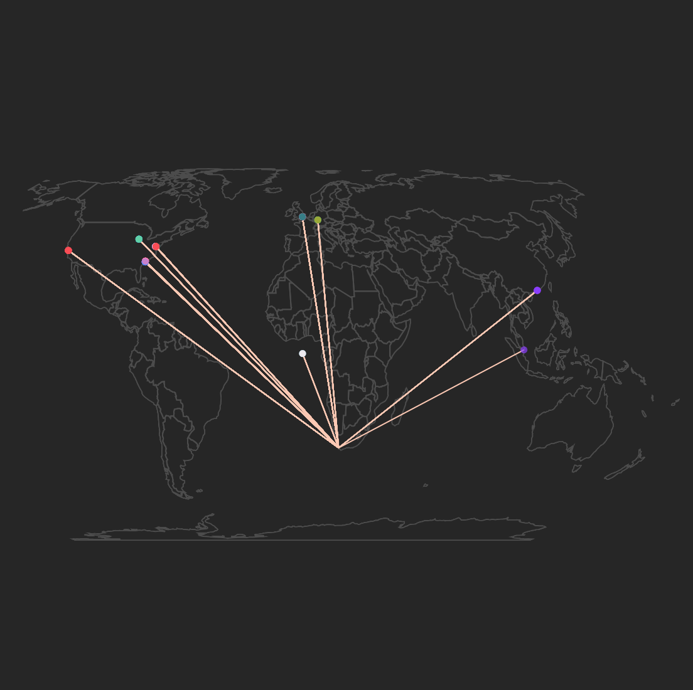
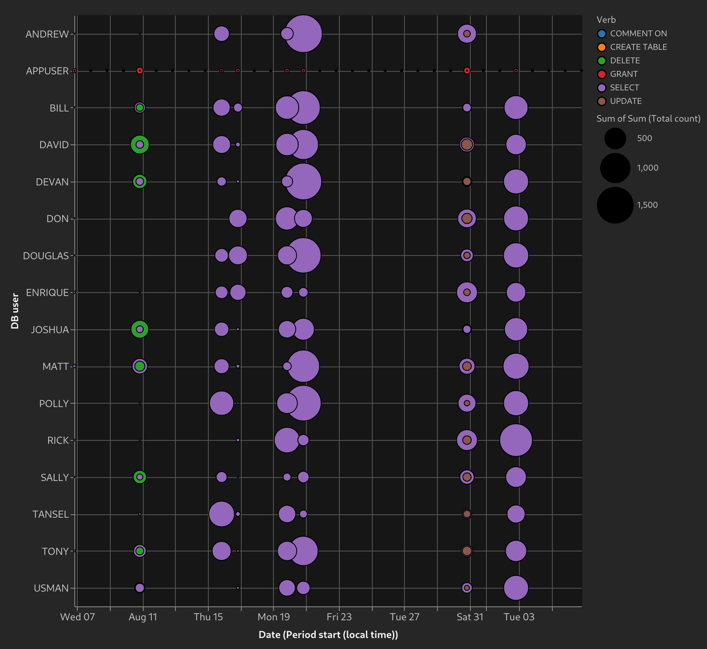
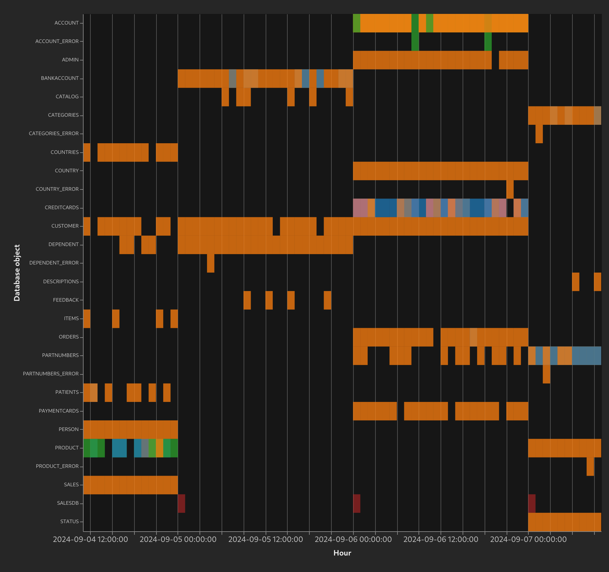

  <h1>Guardium Insights charts</h1>
  A resource for understanding Guardium Insights flex-charts through examples. Copy, paste, and adjust the definitions to make them your own.

  

        <a href="examples/age_of_audit_tasks">
            <h2>Age of audit tasks</h2>
            
        </a>
    

        <a href="examples/connection_sql_scatterplot">
            <h2>User scatterplot showing number of connections and SQL</h2>
            
        </a>
    

        <a href="examples/custom_color_donut">
            <h2>Failed test severity with custom color mappings</h2>
            
        </a>
    

        <a href="examples/datamart_ingestion_90_days">
            <h2>Long term datamart ingestion chart</h2>
            
        </a>
    

        <a href="examples/datamart_ingestion_bubbles">
            <h2>Datamart ingestion bubble per file</h2>
            
        </a>
    

        <a href="examples/day_to_day_difference">
            <h2>Percentage difference between days</h2>
            
        </a>
    

        <a href="examples/failed_login_threshold">
            <h2>Failed login count with visualized threshold</h2>
            
        </a>
    

        <a href="examples/failed_test_severity_over_time">
            <h2>Failed test severity over time</h2>
            
        </a>
    

        <a href="examples/histogram_sql_per_day">
            <h2>Histogram of SQL per day</h2>
            
        </a>
    

        <a href="examples/hour_day_of_week_analysis">
            <h2>Weekday and hour analysis</h2>
            
        </a>
    

        <a href="examples/long_term_day_hour_heatmap">
            <h2>Multi-week hour-date heatmap</h2>
            
        </a>
    

        <a href="examples/map_of_connections">
            <h2>Map showing client connections</h2>
            
        </a>
    

        <a href="examples/object_verb_access_bubble_chart">
            <h2>Object-Verb access bubble chart</h2>
            
        </a>
    

        <a href="examples/previous_day_comparison_to_mean">
            <h2>Yesterday's object access compared to mean</h2>
            
        </a>
    

        <a href="examples/stale_users_dot_plot">
            <h2>Stale users - time since last login</h2>
            
        </a>
    

        <a href="examples/three_octet_connection_analysis">
            <h2>Three octet connection analysis heatmap</h2>
            
        </a>
    

        <a href="examples/top_k_users_by_connection_count">
            <h2>Top 10 users by connection count</h2>
            
        </a>
    

        <a href="examples/two_line_two_axis">
            <h2>2 axis, 2 series chart</h2>
            
        </a>
    

        <a href="examples/user_behavior_object_verb_execution">
            <h2>User audit trail - object and verb access</h2>
            
        </a>
    

        <a href="examples/user_sql_counts_historical_distribution">
            <h2>Yesterday's SQL counts per user comparison to box-plot</h2>
            
        </a>
    

        <a href="examples/y_axis_z_score_comparison">
            <h2>Yesterday's user sql count z-score</h2>
            
        </a>
    

